# DB Diagram - Hệ Thống Phòng Khám Nha Khoa

## Tổng Quan
Hệ thống quản lý phòng khám nha khoa với các chức năng chính:
- Quản lý người dùng (Users, Patients, Doctors, Staff)
- Đặt lịch hẹn (Appointments)
- Quản lý dịch vụ và thuốc (Services, Medicine)
- Báo cáo y tế (MedicalReport, Prescription)
- Thanh toán (Bills, PaymentInstallments)
- Lịch làm việc (DoctorSchedule, StaffSchedule)

## Cấu Trúc Bảng

### 1. Bảng Người Dùng (Users & Profiles)

```mermaid
erDiagram
    users {
        int user_id PK
        nvarchar password_hash
        nvarchar email UK
        nvarchar role
        datetime created_at
        nvarchar avatar
        datetime updated_at
    }
    
    patients {
        int patient_id PK
        int user_id FK
        nvarchar full_name
        nvarchar phone
        date date_of_birth
        nvarchar gender
        datetime created_at
        nvarchar avatar
    }
    
    doctors {
        bigint doctor_id PK
        bigint user_id FK
        nvarchar full_name
        nvarchar phone
        nvarchar address
        date date_of_birth
        nvarchar gender
        nvarchar specialty
        nvarchar license_number UK
        datetime created_at
        nvarchar status
        nvarchar avatar
    }
    
    staff {
        int staff_id PK
        int user_id FK
        nvarchar full_name
        nvarchar phone
        nvarchar address
        date date_of_birth
        nvarchar gender
        nvarchar position
        nvarchar employment_type
        datetime2 created_at
        datetime2 updated_at
        nvarchar status
        date hire_date
        decimal salary
        int manager_id FK
        nvarchar department
        nvarchar work_schedule
        nvarchar notes
    }
    
    relatives {
        int relative_id PK
        int user_id FK
        nvarchar full_name
        nvarchar phone
        date date_of_birth
        nvarchar gender
        nvarchar relationship
        datetime created_at
    }
    
    userfaceimages {
        int id PK
        int user_id FK
        nvarchar face_image
        nvarchar face_encoding
        float confidence_score
        datetime registered_at
        bit is_active
    }
    
    users ||--o{ patients : "has"
    users ||--o{ doctors : "has"
    users ||--o{ staff : "has"
    users ||--o{ relatives : "has"
    users ||--o{ userfaceimages : "has"
    staff ||--o{ staff : "manages"
```

### 2. Bảng Dịch Vụ & Thuốc

### 3. Bảng Lịch Hẹn & Lịch Làm Việc

### 4. Bảng Báo Cáo Y Tế & Đơn Thuốc

### 5. Bảng Thanh Toán & Hóa Đơn

### 6. Bảng Thông Báo & Chat

### 7. Bảng Blog & Nội Dung

## Mối Quan Hệ Chính

### Quan Hệ 1-1:
- `users` ↔ `patients` (qua user_id)
- `users` ↔ `doctors` (qua user_id)  
- `users` ↔ `staff` (qua user_id)
- `appointment` ↔ `medicalreport` (1 lịch hẹn = 1 báo cáo)

### Quan Hệ 1-Nhiều:
- `users` → `relatives` (1 user có thể có nhiều người thân)
- `users` → `userfaceimages` (1 user có thể có nhiều ảnh khuôn mặt)
- `doctors` → `doctorschedule` (1 bác sĩ có nhiều lịch làm việc)
- `staff` → `staffschedule` (1 nhân viên có nhiều lịch làm việc)
- `appointment` → `reexamination` (1 lịch hẹn có thể có nhiều yêu cầu tái khám)
- `medicalreport` → `prescription` (1 báo cáo có thể có nhiều đơn thuốc)
- `bills` → `paymentinstallments` (1 hóa đơn có thể trả góp nhiều đợt)

### Quan Hệ Nhiều-Nhiều:
- `appointment` ↔ `timeslot` (qua slot_id)
- `doctorschedule` ↔ `timeslot` (qua slot_id)
- `staffschedule` ↔ `timeslot` (qua slot_id)

## Các Ràng Buộc Quan Trọng

### Check Constraints:
- `appointment.status`: 'BOOKED', 'COMPLETED', 'CANCELLED', 'WAITING_PAYMENT'
- `bills.payment_status`: 'pending', 'paid', 'cancelled', 'refunded'
- `users.role`: 'MANAGER', 'DOCTOR', 'PATIENT', 'STAFF'
- `staff.employment_type`: 'fulltime', 'parttime'
- `staff.status`: 'active', 'inactive', 'suspended', 'terminated'

### Unique Constraints:
- `users.email` - Email duy nhất
- `doctors.license_number` - Số giấy phép bác sĩ duy nhất
- `doctors.user_id` - 1 user chỉ có thể là 1 doctor
- `patients.user_id` - 1 user chỉ có thể là 1 patient
- `staff.user_id` - 1 user chỉ có thể là 1 staff
- `bills.order_id` - Mã đơn hàng duy nhất

### Foreign Key Constraints:
- Tất cả các khóa ngoại đều có ràng buộc tham chiếu
- Có trigger tự động cập nhật `updated_at` cho `bills` và `staff`

## Indexes Quan Trọng

### Performance Indexes:
- `IX_Bills_CreatedAt` - Tìm kiếm hóa đơn theo ngày tạo
- `IX_Bills_Status` - Lọc hóa đơn theo trạng thái
- `IX_Services_Category` - Lọc dịch vụ theo danh mục
- `IX_Staff_Department` - Lọc nhân viên theo phòng ban
- `IX_UserFaceImages_UserId` - Tìm kiếm ảnh khuôn mặt theo user

## Ghi Chú Thiết Kế

1. **Phân Quyền**: Hệ thống sử dụng role-based access control với 4 vai trò chính
2. **Lịch Hẹn**: Hỗ trợ đặt lịch cho người thân và tái khám
3. **Thanh Toán**: Hỗ trợ trả góp và tích hợp PayOS
4. **Face ID**: Lưu trữ ảnh khuôn mặt và vector đặc trưng cho xác thực
5. **Lịch Làm Việc**: Quản lý lịch bác sĩ và nhân viên với phê duyệt
6. **Báo Cáo Y Tế**: Tích hợp chữ ký số và đơn thuốc
7. **Thông Báo**: Hệ thống template và real-time chat 